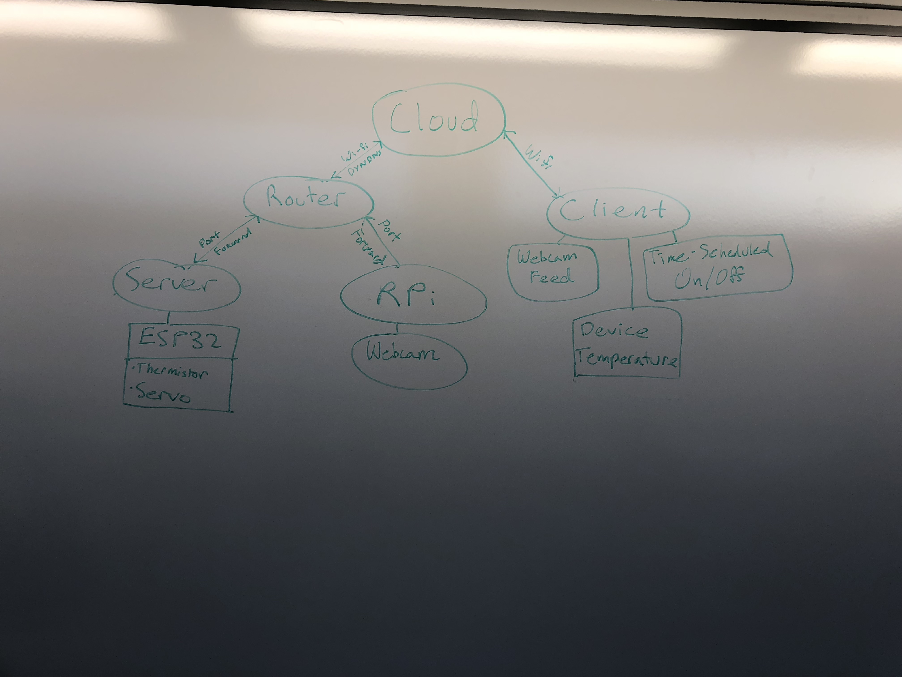
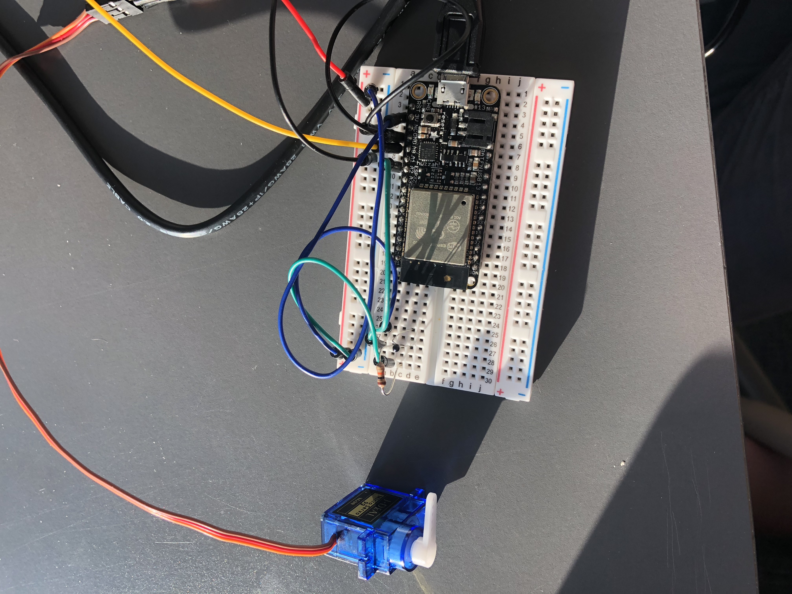
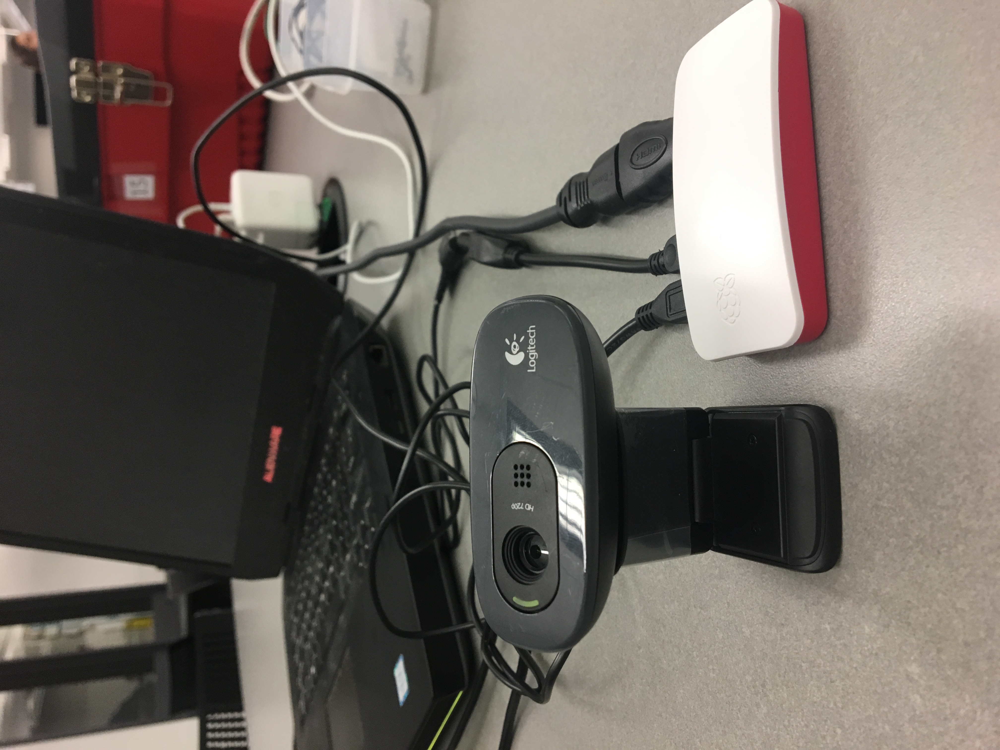
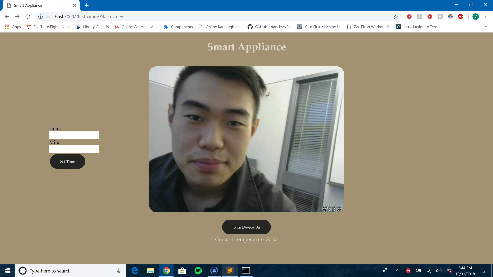

## IoT Smart Appliance
Brian Xu
10/29/18

## Summary
 In this project, I was tasked with implementing a smart device capable of connecting to the Internet and communicating with a local server as well as a remote client.
 From this, the device also had to be able to be controlled by a user from the remote client as well as be monitored from the remote client.
 
## Evaluation Criteria

It was decided on the following specifications for a successful solution to this project:

- Able to monitor the device from the remote client:
    - Webcam w/ Raspberry Pi
    - Thermistor reading of device ambient temperature
    
- Able to control the device from the remote client:
    - Set cook/brew time
    - Turn device on/off
 

## Solution Design
I used Huzzah32 boards (based on the the ESP32 board) as the main processors in this project. The ESP32 is interfaced to read the thermistor and move the servo motor. In addition, it hosts the local server. 

- Thermistor Analog Read : Uses GPIO pin 34 to read temperature
- Servo Component : Uses GPIO pin 26 for 
- Server Component : The ESP32 acts a the smart appliance server. It responds to a "get /temp" request by reading the thermister and reporting a value back. It responds to a put /servo request by creating a timer to go off at the time that you scheduled. When the timer goes off, it starts the servo. 

The Raspberry Pi is a secondary processor used in this project and it is used to run the Web-cam in order to have a live feed to monitor the device.  

The client allows shows live video feed of the smart appliance, updates temperature every 5 seconds, and allows you to schedule a time for the appliance to turn on, or turn it on right away. 

Tomato Router - Serves as the public IP for the smart appliance server and the Rpi. I used port forwarding so that a client can talk to the server from anywhere over the internet. 
## Sketches and Photos

 Solution Design Chart Wiring :

 ESP32 ("Smart Appliance") Wiring :

 Raspberry Pi Wiring :

 Web-Client :

## Modules, Tools, Source Used in Solution

- [Node.js](https://nodejs.org/en/)
- [Socket io](https://socket.io/#examples)
- [W3 Schools](https://www.w3schools.com/)
- [ESP32 HTTP Server API](https://docs.espressif.com/projects/esp-idf/en/latest/api-reference/protocols/esp_http_server.html)
- [Github for HTTP Server](https://github.com/BU-EC444/ec444-repo/tree/master/simple-server)
- [ESP32 Timer](https://esp-idf.readthedocs.io/en/latest/api-reference/peripherals/timer.html)
- [HTTP Request](https://www.npmjs.com/package/request)

## Supporting Artifacts

- [Youtube video demo](https://www.youtube.com/watch?v=3xlgvTYEobY)
